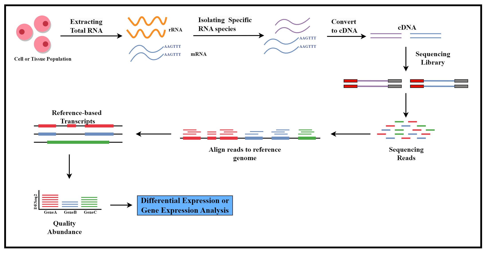

<h1 style="text-align: center;">Dataset</h1>
<a href="https://www.ncbi.nlm.nih.gov/Traces/study/?acc=PRJNA762469&o=acc_s%3Aa"> LINK OF DATSET USED</a>
  
**
BioProject PRJNA762469 is a publicly available project in the NCBI (National Center for Biotechnology Information) database that contains genomic and transcriptomic data for several insect species. The project was submitted by the Department of Entomology at the University of Illinois at Urbana-Champaign and is titled "Comparative genomics of Lepidoptera and Orthoptera: expansion, evolution and diversification of opsin genes."
**
<h1 style="text-align: center;">WORKFLOW</h1>
<h2>File Reading Order -</h2>
<h3>RNA_STAR_ALGORITHM.ipynb  -->   MRmr_Deseq2.ipynb  -->  Deseq2.r</h3>
<h3>Overall Process</h3>

<h3>Detailed Workflow</h3>

